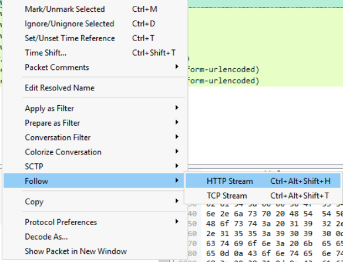
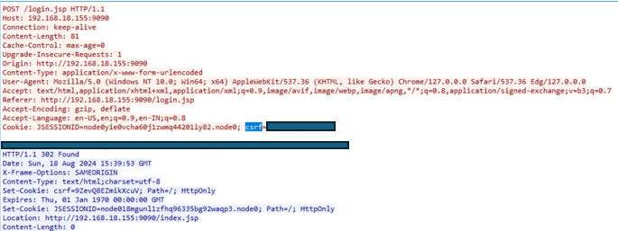
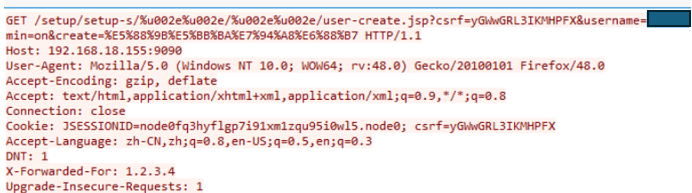
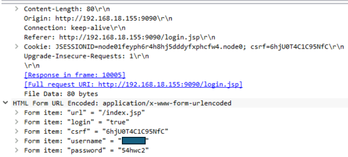
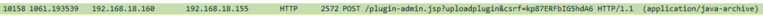
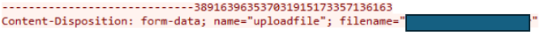
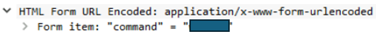
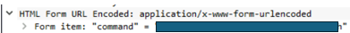
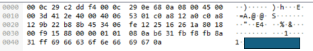
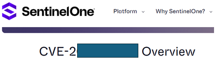

# Openfire — CyberDefenders

> **Category:** Network Forensics
> **Difficulty:** Easy
> **Date:** 2026-03-10
> **Tools:** Wireshark

---

## Executive Summary

An Openfire messaging server was compromised through a known vulnerability (CVE-XXXX-XXXXX). The attacker exploited the authentication bypass to access the admin panel, created rogue user accounts, uploaded a malicious plugin to gain remote code execution, and established a reverse shell for persistent access. The full attack chain was reconstructed from a single PCAP capture.

**Attack Vector:** Authentication Bypass → Admin Panel → Plugin Upload → Reverse Shell

---

## Purpose

This writeup is meant to be understandable by entry-level cybersecurity enthusiasts. It is pragmatic and touches only the surface of what we can do to resolve this challenge. Having fun on those challenges is the most important part!

---

## Attack Timeline

| Timestamp | Event | Evidence |
|---|---|---|
| 2024-08-18 15:54:XX | Rogue accounts created | HTTP POST body |
| 2024-08-18 15:55:XX | Attacker authenticates to admin panel | HTTP stream with credentials |
| 2024-08-18 15:55:XX | Malicious plugin uploaded | HTTP stream with filename |
| 2024-08-18 15:56:XX | Remote command execution via plugin | HTTP POST body |
| 2024-08-18 15:56:XX | Attacker gains interactive shell | Network traffic between attacker/server |
| 2024-08-18 15:57:XX | Attacker enumerates interfaces | Command execution logs |

---

## Investigation Process

### Q1 — What is the CSRF token value for the first login request?

#### Approach

A CSRF token is a unique, secret and random value used to ensure that a request is legitimate. It is a defensive mechanism against cross-site request forgery attacks.

We know that we are searching for a CSRF token and more importantly a login request. I like to use the filters `frame contains "word"` combined with `http.request.method`. The `frame contains` filter allows you to find ASCII text in the packet. Once the filter is applied, right-click on the first packet and follow the HTTP stream, then use `Ctrl+F` to search for "csrf".

#### Filter

```
frame contains "csrf" and http.request.method==POST
```


*Filtering for POST requests containing "csrf"*



*CSRF token found in the HTTP stream*

---

### Q2 — What is the password of the first user who logged in?

#### Approach

The password is visible in the same HTTP stream as the previous question — the login POST request contains both the username and password in cleartext.

#### Filter

Same as Q1.

---

### Q3 — What is the first username created by the attacker?

#### Approach

We saw in the previous question that the login file ends with `.jsp`. So we need something that creates an account on JavaServer Pages — `user-create.jsp`. We put it in the filter and take the first result.

#### Filter

```
frame contains "user-create.jsp"
```


*First user creation request showing the attacker's new account*

---

### Q4 — What is the username that the attacker used to login to the admin panel?

#### Approach

We are searching for the login page with `.jsp` still combined with the `http.request.method` filter. We get several results so we want to find the login that is not called "admin".

#### Filter

```
http.request.method==POST && frame contains "login.jsp"
```


*Identifying the attacker's login to the admin panel*

---

### Q5 — What is the name of the plugin that the attacker uploaded?

#### Approach

I rushed a little bit on this one because I thought I could find the openfire-plugin directly by filtering on the `.jar` extension, but it was not that simple. However, I noticed a Java archive in the POST requests and connected it to the possible malicious upload. I followed the HTTP stream and searched for a filename.

#### Dead End

Tried filtering for `frame contains ".jar"` expecting to find the plugin file directly — no relevant results. Had to broaden the search to all POST requests and manually inspect them.

#### Filter

```
http.request.method==POST
```



*Locating the Java archive upload in POST requests*



*Plugin filename revealed in the HTTP stream:*

---

### Q6 — What is the first command that the user executed?

#### Approach

When you have some CTF experience, the command parameter is quite common. Using `frame contains "command"` combined with the POST filter reveals the answer for this question and the next one.

#### Filter

```
http.request.method==POST && frame contains "command"
```


*First command executed through the malicious plugin*

---

### Q7 — Which tool did the attacker use to get a reverse shell?

#### Approach

With the previous filter you can see the answer easily. It is a well-known tool. If you do not know the abbreviation, a quick search will clarify it.

#### Filter

Same as Q6.


*Reverse shell tool identified in the command parameter*

---

### Q8 — Which command did the attacker execute to check for network interfaces?

#### Approach

I asked myself: how can I find network interfaces with just one command on Windows or Unix? Quite easy to answer if you have prior knowledge in networking, otherwise a quick search will help. To narrow the filter, I used the source and destination IPs found in the previous question.

#### Filter

```
ip.src==192.168.18.160 && ip.dst==192.168.18.155 && frame contains "config"
```


*Network interface enumeration command captured*

---

### Q9 — What is the CVE of the vulnerability exploited?

#### Approach

Nothing magical with this one. I searched for "CVE openfire-plugin reverse shell" and found the answer.


*The CVE associated with this Openfire vulnerability*

---

## Indicators of Compromise

| Type | Value | Context |
|---|---|---|
| IP | 192.168.18.160 | Attacker IP |
| IP | 192.168.18.155 | Compromised server |
| CVE | CVE-XXXX-XXXXX | Openfire X X |
| File | Malicious .jar plugin | Uploaded for RCE |

---

## Lessons Learned

- **Dead end on Q5:** I tried to find the plugin by filtering directly on the file extension, which did not work. Broadening the search and manually inspecting POST requests was the right pivot. Lesson: do not assume that the obvious filter will always work.
- **Filter strategy:** `frame contains` combined with `http.request.method==POST` is an extremely powerful combination for HTTP-based investigations. It became my go-to approach throughout this challenge.
- **Mindset:** On easy challenges, the goal is not just to find the flag but to build a repeatable methodology that scales to harder investigations and having fun ^^!

---

## References

- [CyberDefenders — Openfire Challenge](https://cyberdefenders.org/blueteam-ctf-challenges/openfire/)
